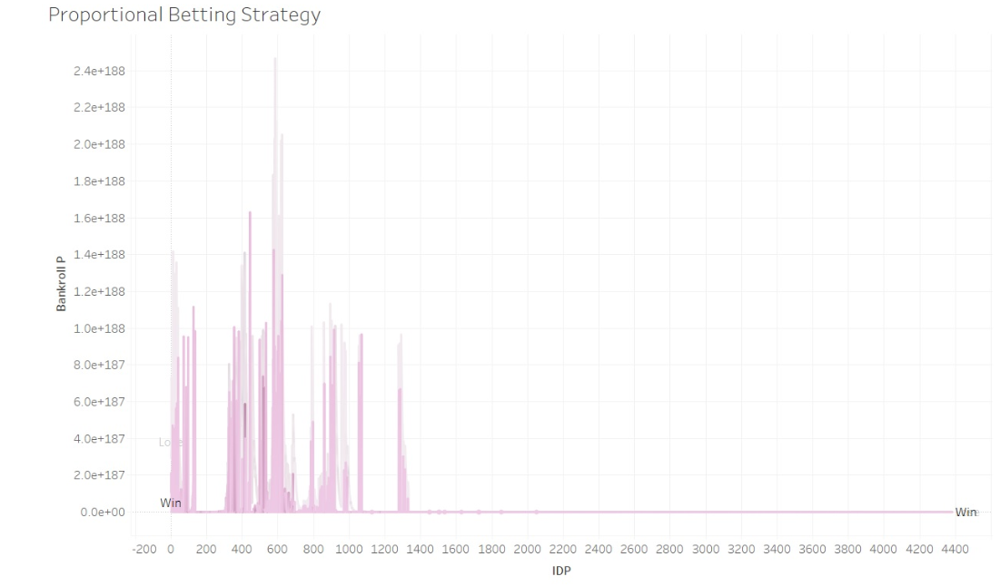
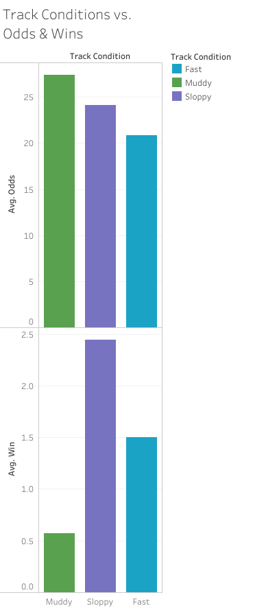
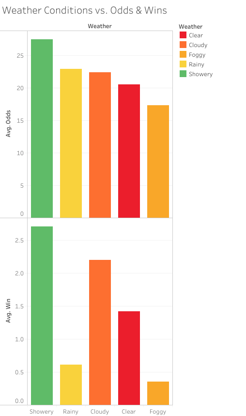
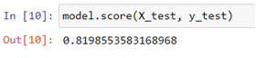
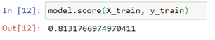
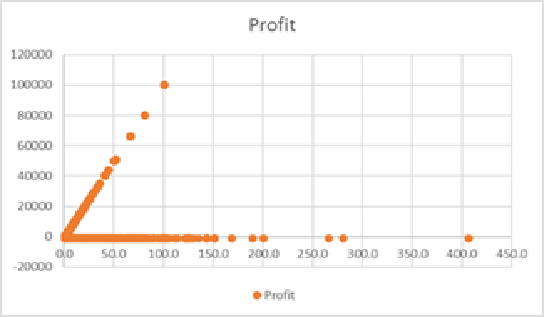
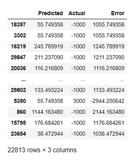
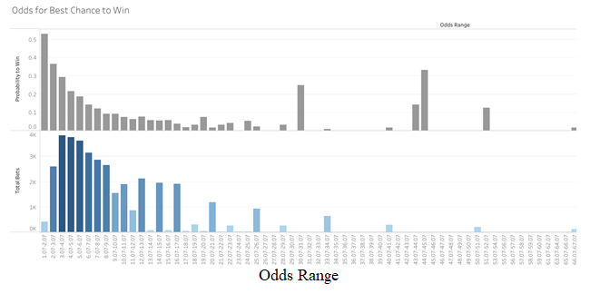

# Horse Race Gambling

## Jake Geiser, Carlie Azar, Erin Lee, Andrea Pappa, & Dave Moorman

## Table of Contents
- [Introduction](#introduction)
- [Data Source](#data-source)
- [Approach through Programming](#project-approach-through-programming)
- [Methodology](#methodology)
- [Machine Model](#machine-model)
- [Sources](#sources)
- [Contact Us](#contact-us)

## Introduction
On an international scale, horse race betting has proven to be an extremely lucrative gamble. Outcomes can depend on a wide variety of external contributing factors, but for the purpose of this project we have chosen to focus on weather and track conditions, success of jockeys and trainers, but also probabilities of winning given the odds. We have constructed a machine learning model that analyzed if the odds for a particular horse would contribute to the chances of winning or losing, and from that a profit was calculated. There are many different betting strategies available for universal use, but we focused on calculating the profits for four of them outside of our model: Bet It All, Martingale System, Proportional Betting, and Fixed Betting to be able to give a recommendation on which system on should be factoring into their betting strategy.

## Data Source
The data we used for our project was sourced from Kaggle, containing over 38,000 rows of data from 2014 - 2016, that we used as a starting point for our project. Relevant information pulled from these rows were the name of the horse, date of the race, betting odds, and the outcome of the event. 
Another dataset was also pulled from Kaggle, containing information on the weather, track conditions, and jockey and trainer names for each horse that raced in any of the triple crown races from 2005 - 2019.

## Project Approach through Programming
* JavaScript with Flask
* D3 and Javascript Plotly for Visualizations
* Machine Learning using Linear SVM Model
  * Scikit-Learn
* Python Pandas
* Tableau for Data Visualizations
   *[Tableau](https://public.tableau.com/profile/david.moorman#!/vizhome/HorseRacingOddsBetting/OddsforBestChancetoWin?publish=yes)   
* Excel Pivot Tables
* Hosting on Heroku - <a href=https://final-jockey.herokuapp.com>Visit app HERE!</a>

## Methodology
Inside any betting challenge, there are always various ways people seek out to receive a maximum return given the odds and the bet placed. Together we looked into several different betting strategies: Bet It All, Martingale System, Fixed Amount Betting, and Proportional Betting to see which one would yield higher profits. Every simulation we ran with these four methods had an initial bet of $100, besides the Bet It All strategy, having an initial bet of $1000.

*Bet It All*: place your entire balance, or bankroll, on every bet.

*Martingale System*: double your bet after every loss, so eventually when you win you can make up your losses and then make a profit from the original bet placed.

*Fixed Amount*: Every bet that has at least a 55% chance of a winning outcome, you will place the same fixed amount. Having a 0.55 probability of winning will not deplete your bankroll as you try to recover your profit. 

*Proportional Betting*: betting a portion of your bankroll on every bet, in this project we used 0.10 or 10% of your bankroll. Depending on the result of the race, if you win then you add that profit to bankroll and the next bet is 10% of the newly increased balance. Conversely, if you lose then your bankroll is deducted the amount of the loss and the next bet is 10% of the newly decreased bankroll and so on. 

After running our data through these four simulations, it was found that the Proportional Betting strategy yielded the highest profits over the longest time the better could place bets. Since the gamblers’ bankroll influxed according to the results of the previous race, more bets were able to be placed and more money was able to be earned through only betting 10% of the adjusted bankroll for every bet.

Horse Racing has many factors that contribute to the outcome of the race, and some that we investigated were Track and Weather Conditions, the accumulation of wins a Jockey and Trainer had, and how those corresponding with race outcomes and betting odds. The figures below show that from the Triple Crown data we interpreted, sloppy and fast track conditions resulted in higher amounts of wins; showery and cloudy weather conditions increased the chances of race wins with higher odds. 

  

  
## Machine Model
Developed a Support Vector Machine (SVM) linear classifier model within Pandas (Python) to determine if the odds of a horse can predict a win or loss.  An estimated profit was determined from the odds assigned to each horse and if it won.  If the horse loses, its calculated profit is the loss of the initial bet.  In this case, we used $1000 for each horse.  A negative profit (-$1000) would be a loss while a positive profit ($1000 x odds multiplier) would be a win.

_Score on the Original Model_

  
_Score on the Trained Model_

  
Surprisingly the model scored 0.81 or better for the original and “trained” model runs.  Looking at the scatter plot of the data, there is clear bifurcation of the losses vs the wins for the various horses.  Where there is a profit (win) the profit increases linearly.  The losses are simply grouped along the x-axis for each of the various odds placed for each horse.

  
Next a linear regression analysis was performed on the “trained” model and a test of this model was run against the actual results of the race.  As you can see, below, there is a large error for this model and should not be used for predicting which horse will win based on its odds.

  
A more practical method is to evaluate a horse’s odds versus its actual observed results.  Here, you can see pretty quickly that a horse is more likely to win with the better odds, but the payout is larger with the higher odds, but with a lower probability to win.

  

## Sources
1. [https://www.gamblingsites.org/sports-betting/beginners-guide/basic-probability-and-value/#:~:text=In%20sports%20betting%2C%20implied%20probability,is%200.4%2C%20or%2040%25.](https://www.gamblingsites.org/sports-betting/beginners-guide/basic-probability-and-value/#:~:text=In%20sports%20betting%2C%20implied%20probability,is%200.4%2C%20or%2040%25.)

2. [https://towardsdatascience.com/how-machine-learning-could-help-on-horse-racing-betting-part-1-7aa363f75ca2](https://towardsdatascience.com/how-machine-learning-could-help-on-horse-racing-betting-part-1-7aa363f75ca2)

3. [https://learn.problemgambling.ca/probability-odds-random-chance#:~:text=To%20convert%20odds%20to%20probability,1%2F5%20or%2020%25.](https://learn.problemgambling.ca/probability-odds-random-chance#:~:text=To%20convert%20odds%20to%20probability,1%2F5%20or%2020%25.)

4. [https://www.investopedia.com/terms/r/returnoninvestment.asp](https://www.investopedia.com/terms/r/returnoninvestment.asp)

5. [https://www.bigonsports.com/most-profitable-betting-strategy/](https://www.bigonsports.com/most-profitable-betting-strategy/)

6. [https://wagerstreet.com/sports-betting-strategy/the-different-types-of-sports-betting-bankroll-methods/#:~:text=Fixed%20Betting,could%20be%20an%20effective%20strategy. ](https://wagerstreet.com/sports-betting-strategy/the-different-types-of-sports-betting-bankroll-methods/#:~:text=Fixed%20Betting,could%20be%20an%20effective%20strategy.)

7. [https://towardsdatascience.com/how-to-improve-sports-betting-odds-step-by-step-guide-in-python-94626b852f45](https://towardsdatascience.com/how-to-improve-sports-betting-odds-step-by-step-guide-in-python-94626b852f45)

8. [https://www.amwager.com/horse-racing-odds](https://www.amwager.com/horse-racing-odds)

9. [https://www.kaggle.com/gunner38/horseracing](https://www.kaggle.com/gunner38/horseracing)

10. [https://www.kaggle.com/jmolitoris/triple-crown-of-horse-races-2005-2019](https://www.kaggle.com/jmolitoris/triple-crown-of-horse-races-2005-2019)

## Contact us
Jake Geiser: Email: git@jakegeiser.us 

Dave Moorman: Email: davemoorman@hotmail.com LinkedIn: https://www.linkedin.com/in/dave-moorman-39986a15/ 

